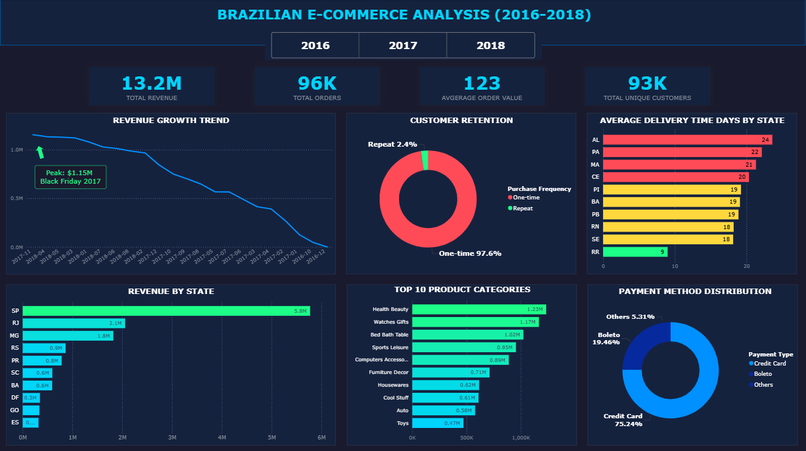

# **Olist Brazilian eCommerce Analysis**
## **Project Overview**
This project analyzes Brazilian eCommerce data from Olist spanning 2016-2018, examining revenue trends, customer behavior, product performance, and operational efficiency. The analysis uses SQL for data processing and Power BI for interactive visualization.

## **Tools Used**
* **Language:** SQL  
* **Database:** MySQL  
* **SQL Client:** MySQL Workbench 8.0 CE
* **Visualization:** Power BI Desktop
## **Project Structure**
The project files are organized into three main content folders, clearly separating data, code, and final visualizations:
* **Datasets**: Contains the 7 raw dataset files (e.g., `olist_customers_dataset`) used as the source for the entire analysis.
* **README.md**: Primary project documentation, summarizing the methodology and key business insights.
### `/sql/`
- **DDL_Schema** - Database schema creation.
- **Data_Cleaning_Transformation** - Data type conversion.
- **Analytical Queries** - 14 SQL scripts (.sql) complete with business insights documented.
### `/Power BI Dashboard/`
- Images of the interactive dashboard includes year filtering (2016, 2017, 2018, Overall). 

**Note:** SQL queries in `/sql/queries/` show the core analysis logic. 
For Power BI implementation, a `YEAR` column was added to enable 
interactive filtering. This modification does not change the 
analytical approach or business insights.

## **Dataset Description** 
- **Source: Kaggle (Brazilian eCommerce Public Dataset)**
- Time Period: 2016 - 2018
- Data Structure: 7 Interconnected Tables (Customers, Orders, Order Items, Payments, Reviews, Products, and Category Translation)
- Project Objective: Analyze eCommerce performance, quantify severe customer retention, and optimize logistics to drive strategic recommendations.

## **Business Questions**
 This analysis addresses the following key questions:
### 1: What is the overall business performance across 2016-2018?
   * Total: 96K orders, 93K unique customers, $13.2M revenue across 2016-2018.
   * Avg item price: $119.98, showing mid-range product focus.

### 1.1: How has monthly revenue changed over time?
   * Peak: November 2017 ($1.15M) - Black Friday effect.

### 1.2: Which states are our top revenue contributors?
   * São Paulo (SP) and Rio de Janeiro (RJ) dominate revenue annually, consistently accounting for over 30% of total revenue.

### 1.3: When does each state achieve its highest revenue?
   * SP peaked May 2018 ($478K).
   * Black Friday 2017 drove peak performance across most regions.

### 2: Which product categories generate the most revenue?
   * Health Beauty leads at $1.23M, followed by Watches Gifts $1.17M and Bed Bath Table $1M.
   * Top 5 categories contribute 46% of total revenue, showing category concentration.

### 3: How long does delivery take in different states?
   * Massive gap: Northern states 26-29 days vs SP 8.7 days.
   * 3.4x delivery time difference between best and worst regions.

### 3.1: Are we meeting our delivery time promises?
   * Actual delivery: 12.5 days vs Estimated: 24.4 days, consistently delivering 11.9 days earlier than promised.

### 4: Who are our highest-spending customers and where are they located?
   * Top 10 customers: AOV ranges $4,400-$13,400, all one-time buyers.
   * High spenders concentrated in RJ, ES, MS, SP regions.

### 5: What are our most popular products by quantity sold?
   * Top seller: Furniture Decor with 527 units at $71.36 avg price.
   * Best sellers concentrated in home categories: Furniture, Bed Bath, Garden Tools.

### 6: How do customers prefer to pay for their orders?
   * Credit card dominates: 75-77% of orders across all years.
   * Avg installments declining: 4.4 (2016) → 3.3 (2018), suggesting lower cart values.

### 7: Do payment preferences vary by state?
   * SP leads all payment types: 32K credit card, 8.2K boleto orders.
   * Credit card dominates every state; boleto remains consistent secondary option.

### 8: Are customers coming back to buy again? 
   * One-time buyers: 97-99% annually, repeat rate critically low at 1-3%.
   * Repeat customers show marginally higher satisfaction (4.17-4.20 vs 4.01-4.17).

### 9: How satisfied are our customers based on their ratings?
   * 5-star reviews: 59.22%, showing strong satisfaction base.
   * 1-star reviews: 9.76%, representing significant dissatisfied segment needing attention.

### 10: What percentage of orders are successfully delivered?
   * 97.02% orders delivered successfully, showing strong operational efficiency.
   * Cancellation + unavailable: 1.24% combined, minimal failure rate.

## **Dashboard**
### Dashboard Overview (2016-2018)

## **Key Business Insights**

### 1. Customer & Revenue Focus
- Retention Challenge: The platform faces a severe issue, with 97-99% of customers are one-time buyers with repeat rates at only 1-3% annually.

- Geographic Concentration: SP and RJ contribute over 30% of revenue annually, while the Top 5 categories account for 46% of total revenue.

-  Seasonal Revenue Peak: Revenue peaked at $1.15M in November 2017, driven by Black Friday promotions.

### 2. Operational & Payment Focus
- Regional Delivery Gap: Northern states face delivery times 3.4x longer (up to 29 days) compared to SP (8.7 days).

- Early Deliveries: Orders arrive 11.9 days earlier than estimated (12.5 actual vs 24.4 estimated).

- Payment Preference: Credit Card is the dominant payment method, used in 75-77% of transactions, though the average number of installments is declining.

## **Recommendations**

### 1. Improve Customer Retention
With 97-99% one-time buyers, implementing post-purchase follow-up campaigns (email reminders, discount codes) within 30 days could help increase the current 1-3% repeat rate.

### 2. Address Northern Region Delivery Times
The 3.4x delivery gap in Northern states (29 days vs 8.7 in SP) suggests potential logistics bottlenecks. Investigating warehouse locations or carrier partnerships could improve service in these underserved regions.

### 3. Leverage Seasonal Revenue Peaks
Black Friday 2017 generated $1.15M in peak revenue. Planning Q4 campaigns earlier (August-September) and coordinating with top-performing categories could help maximize future seasonal opportunities.

## **Contact Me**

👨‍💻 Gia Lac Tien (Carlos)  
✉️ Email: tgialac1712@gmail.com  
💼 LinkedIn: linkedin.com/in/gialactien  
🐱 GitHub: github.com/Carlostgl  
